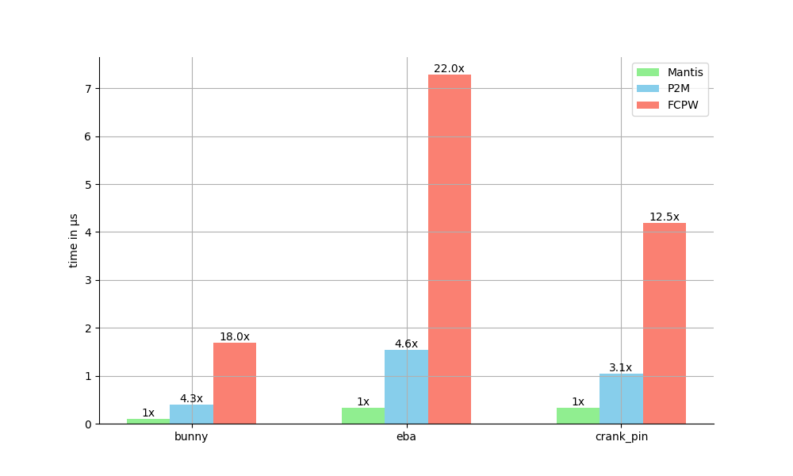

<div align="center">

</div>

[](https://github.com/Janos95/mantis/actions/workflows/cmake-multi-platform.yml)

Mantis is a C++ library for doing very fast distance-to-mesh queries. 
It implements the [P2M algorithm](https://yuemos.github.io/Projects/P2M/pdf/P2M_author.pdf) and uses NEON, SSE or AVX512 instructions to significantly accelerate query performance.
Here are some of the highlights of Mantis:

- **Blazingly Fast**: Mantis is multiple times (3-20x) faster than the original P2M implementatino and the popular FCPW library.

- **MIT Licensed**: Mantis is permissively licensed under the MIT license.

- **Simple to Build**: Thanks to [geograms](https://github.com/BrunoLevy/geogram) pluggable delaunay module, Mantis only consists of four files and doesn't require any external dependencies.

## Getting Started

### Prerequisites

To build mantis you will need a C++ Compiler with C++17 support.

### Building

Mantis consists of four files `mantis.h`, `mantis.cpp`, `Delaunay_psm.h`, and `Delaunay_psm.cpp`.
You can just grab these files and add them to your build system of choice. 
For convenience, you can also use the provided CMakeLists.txt. For example 
to fetch and use with CMake's `FetchContent`:

```cmake
FetchContent_Declare(
  mantis
  GIT_REPOSITORY https://github.com/Janos95/mantis 
)

FetchContent_MakeAvailable(mantis)

target_link_libraries(my_target PRIVATE mantis)
```

## Example Usage

Here is a simple example of how to use mantis.

```cpp
#include <mantis.h>

// your triangle mesh
std::vector<std::array<float, 3>> points;
std::vector<std::array<uint32_t, 3>> triangles;

// build the acceleration structure
mantis::AccelerationStructure accelerator(points, triangles);

// choose a query point
std::array q = {0.f, 1.f, 2.f};

// perform the query
mantis::Result result = accelerator.calc_closest_point(q);

printf("distance to mesh is %f\n", std::sqrt(result.distance_squared));

```

The example folder includes two demos using Mantis. The first one demonstrates converting a triangle mesh into a signed distance field, which is useful for things like implicit modeling.
In the image below you can see how mantis can be used to do a smooth union of a sphere and the Stanford bunny while
achieving interactive frame rates. The distance field for the bunny is calculated on the fly for each frame.

<div align="center">

</div>

The second one implements the walk of spheres algorithm, which is a stochastic algorithm to solve Laplace equations.
In the image below you can see how mantis is used to solve the Laplace equation on a plane using the walk of spheres algorithm
and using the x coordinate of the vertex normals of the bunny as a boundary condition.

<div align="center">

</div>

## Benchmarks

These benchmarks compare the performance of mantis with the original P2M implementation and FCPW for three different meshes (which can be found in the assets folder). 
The test meshes are normalized to be contained in a unit bounding box and the queries are sampled uniformly at random from the bounding box [-5, 5]^3.
For FCPW the simd width is always set to 4. I experimented with a few different simd widths and 4 seemed to give the best performance.

Here are the results running on AMD Ryzen 9 5950X compiled on MinGW. In these benchmarks mantis takes advantage of
the AVX512 instruction set. Typically though, AVX512 only provides a 20-50% speedup over SSE4.2.
On top of every bar you can see the slowdown compared to mantis.
<div align="center">

</div>

In the second figure you can see the same test cases but compiled with clang on a MacBook Pro with an M2 Max CPU. 
In these benchmarks mantis takes advantage of the ARM NEON instruction set.

<div align="center">

</div>

## Caveats

- The construction of the acceleration structure is not optimized yet, so it's pretty slow for very large meshes.
- For vertices with long interception lists, the original P2M paper suggests to implement an R-tree to speed up the query. This is not implemented in Mantis yet. This could potentially lead to a slowdown for highly symmetric shapes such as a perfect sphere.
